# Chapter 8 수학 함수와 그래픽 함수 (Math Functions and Graphics Functions)

## 8.10 circle 함수와 화면 종횡비

#### [그림 8.10-2] <예제 CIRCLE.C> 실행 결과 하드카피 (HGC)
||||
|-|-|-|
|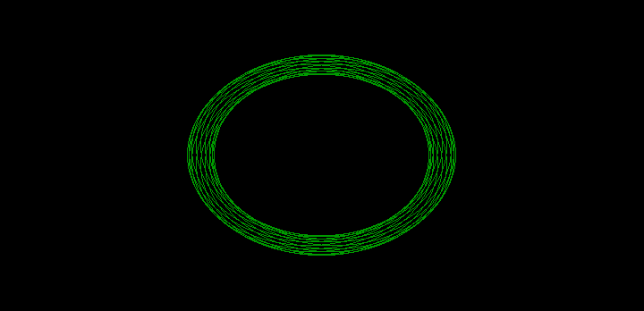|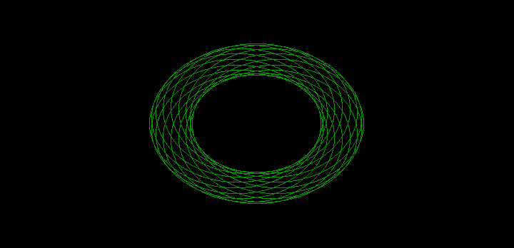|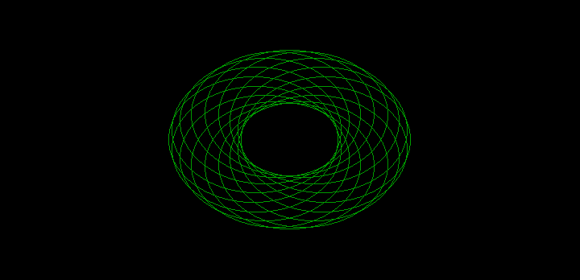|
|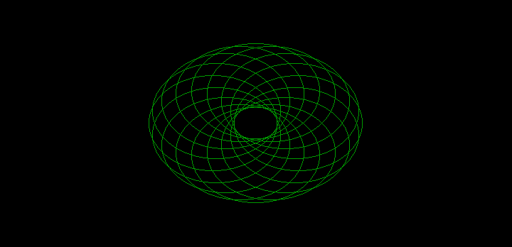|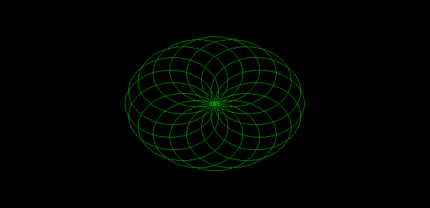|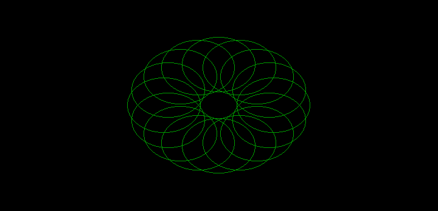|

#### [그림 8.10-2] <예제 CIRCLE.C> 실행 결과 하드카피 (EGA)
||||
|-|-|-|
|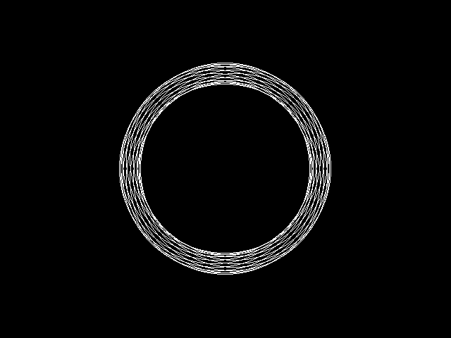|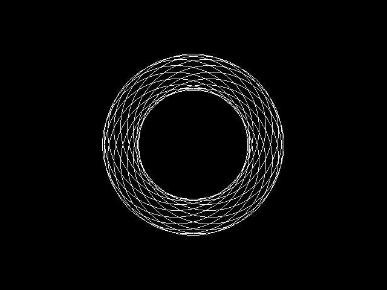|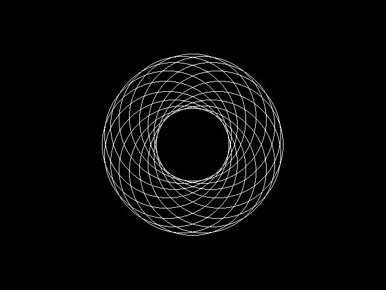|
|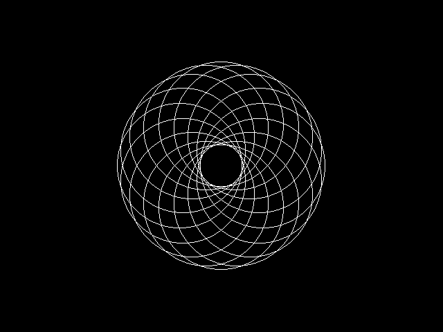|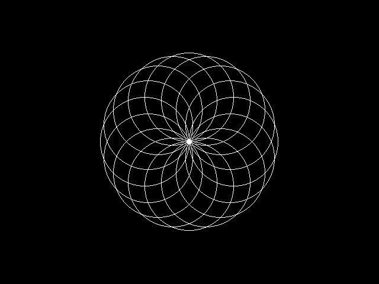|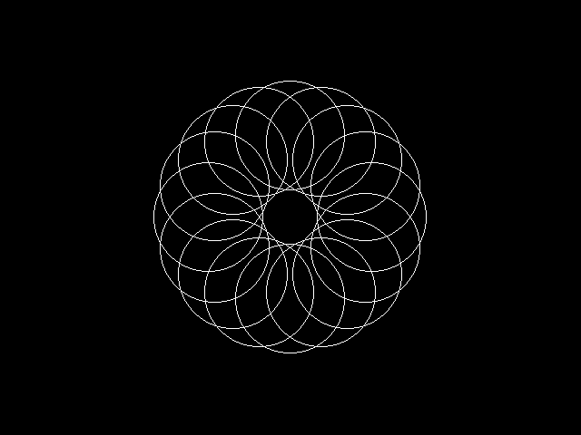|
