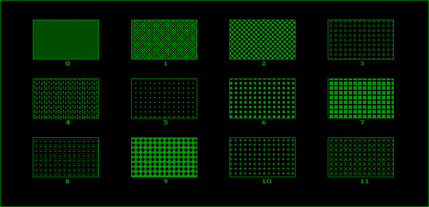
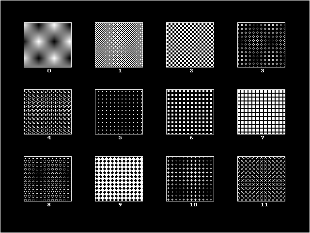

# Chapter 17 그래픽 함수 II (Graphics Function II) / 그래픽 예제와 확장 그래픽 함수 (Graphics Examples and Extended Graphics Functions)

## 17.3 사용자 정의 무늬 설정 함수

#### [그림 17.3-1] <예제 FILLPATT.C> 실행 결과 (HGC)

#### [그림 17.3-1] <예제 FILLPATT.C> 실행 결과 (EGA)

