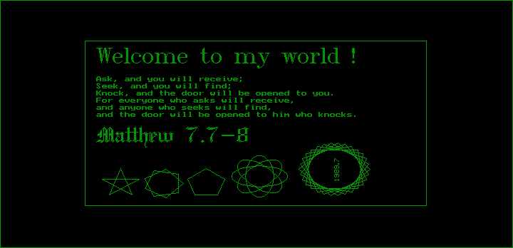
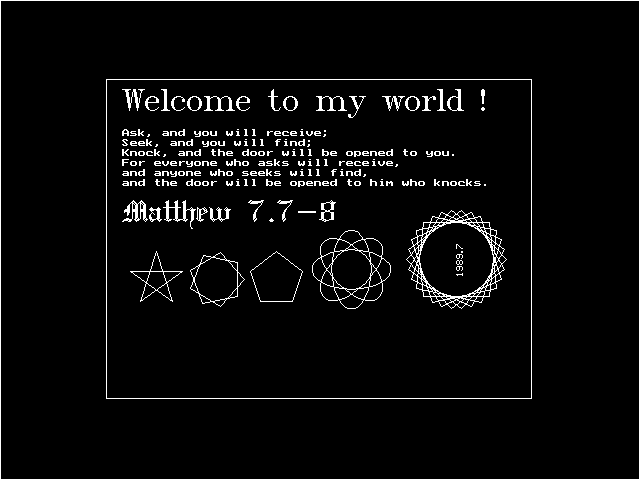

# Chapter 17 그래픽 함수 II (Graphics Function II) / 그래픽 예제와 확장 그래픽 함수 (Graphics Examples and Extended Graphics Functions)

## 17.6 확장 그래픽 라이브러리

### 17.6.3 확장 그래픽 라이브러리의 사용 예

#### [그림 17.6-1] <예제 GPRINTF.C> 실행 결과 (HGC)

#### [그림 17.6-1] <예제 GPRINTF.C> 실행 결과 (EGA)

