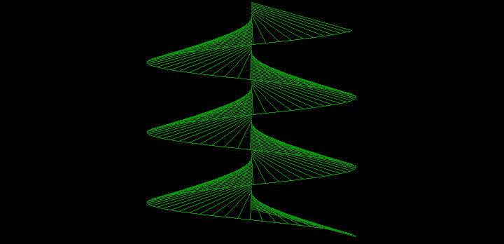
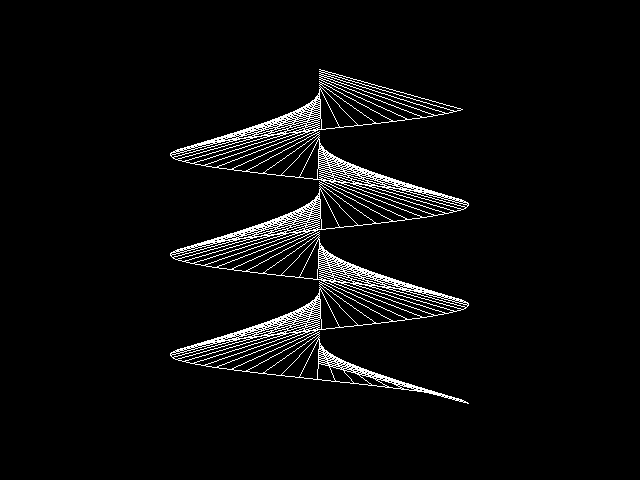

# Chapter 17 그래픽 함수 II (Graphics Function II) / 그래픽 예제와 확장 그래픽 함수 (Graphics Examples and Extended Graphics Functions)

## 17.1 그래픽 예제 모음

### 17.1.2 헬리코이드

#### [그림 17.1-2] <예제 HELICOID.C> 실행 결과 (HGC)

#### [그림 17.1-2] <예제 HELICOID.C> 실행 결과 (EGA)

