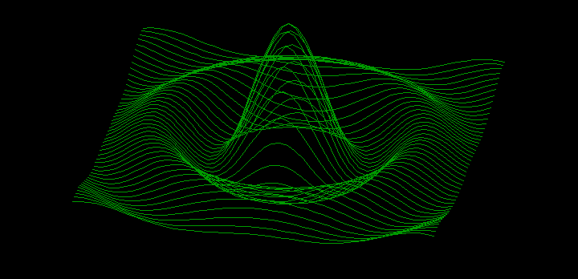
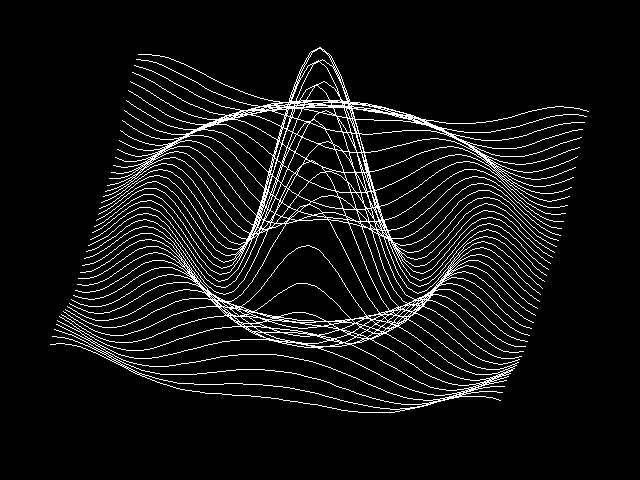

# Chapter 17 그래픽 함수 II (Graphics Function II) / 그래픽 예제와 확장 그래픽 함수 (Graphics Examples and Extended Graphics Functions)

## 17.5 확장 그래픽 예제

### 17.5.1 멕시코 모자 (3차원 그래픽)

#### [그림 17.5-1] <예제 SOMBRERO.C> 실행 결과 (HGC)

#### [그림 17.5-1] <예제 SOMBRERO.C> 실행 결과 (EGA)

