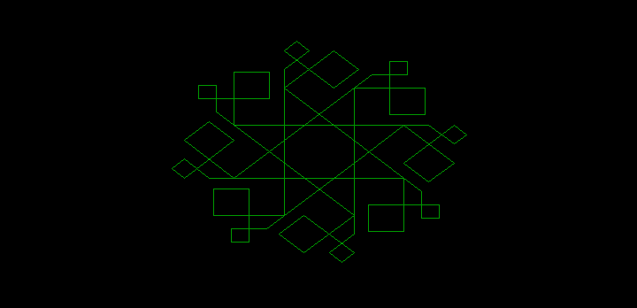
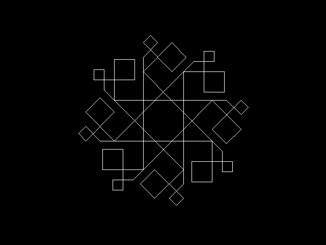

# Chapter 18 그래픽 함수 III (Graphics Function III) / 터틀 그래픽 함수 (Turtle Graphics Functions)

## 18.7 터틀 그래픽 예제

### 18.7.3 크리스탈

#### [그림 18.7-3] <예제 CRYSTAL.C> 실행 결과 (HGC)

#### [그림 18.7-3] <예제 CRYSTAL.C> 실행 결과 (EGA)

