# Chapter 18 그래픽 함수 III (Graphics Function III) / 터틀 그래픽 함수 (Turtle Graphics Functions)

## 18.7 터틀 그래픽 예제

### 18.7.7 회괴한 오각형

#### [그림 18.7-7] <예제 FANTAGON.C> 실행 결과 (HGC)
||||
|-|-|-|
|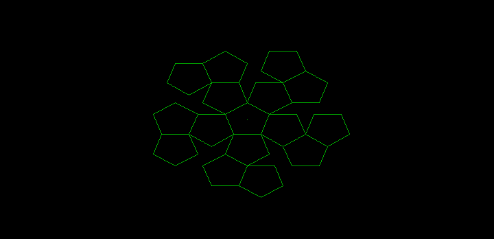|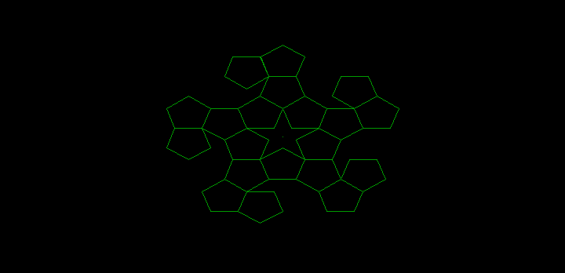|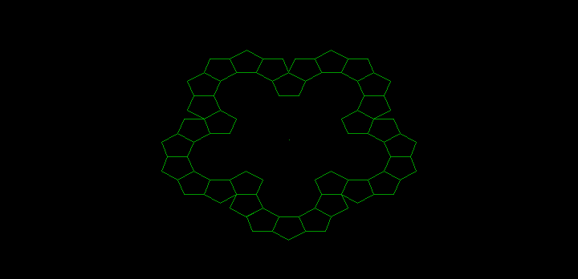|
|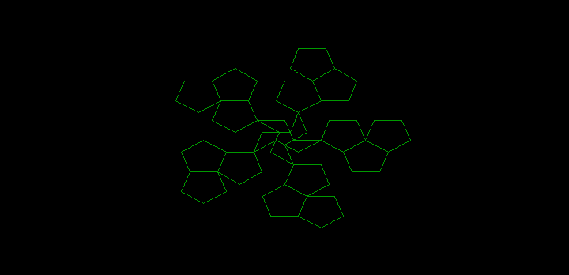|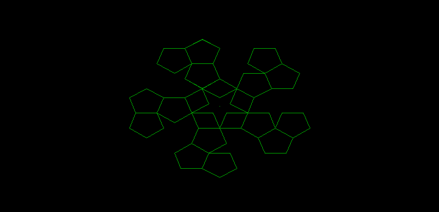|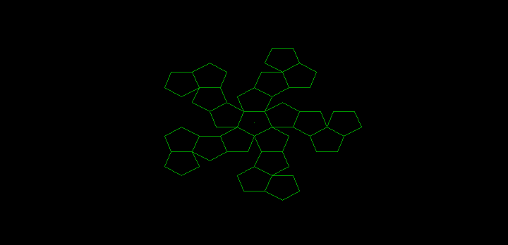|
|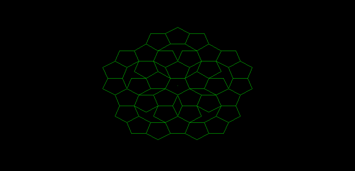|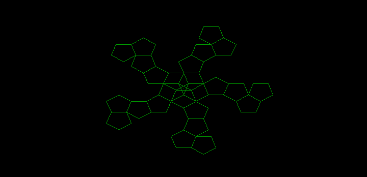|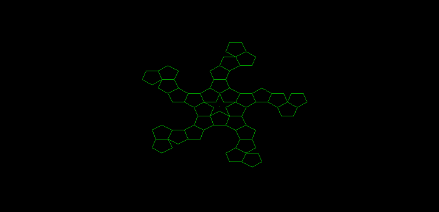|
|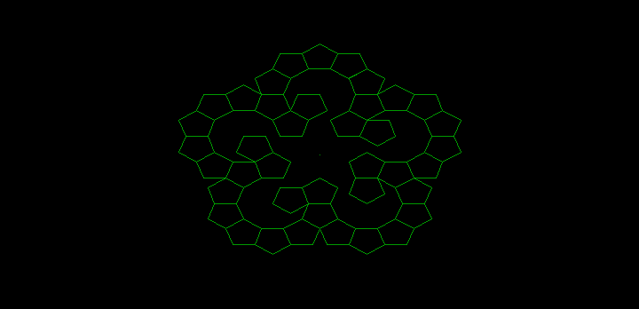|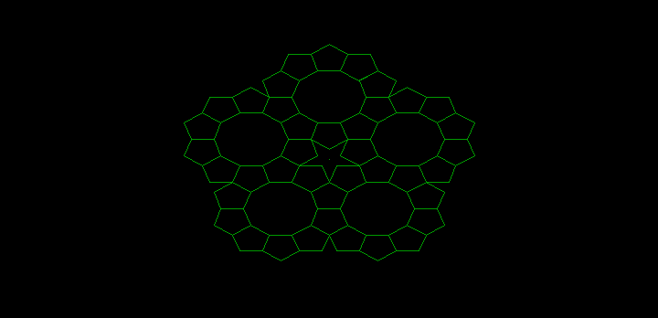|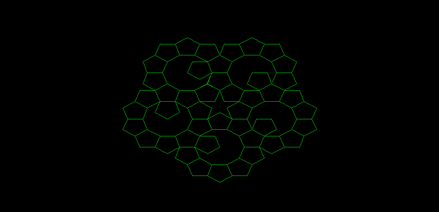|

#### [그림 18.7-7] <예제 FANTAGON.C> 실행 결과 (EGA)
||||
|-|-|-|
|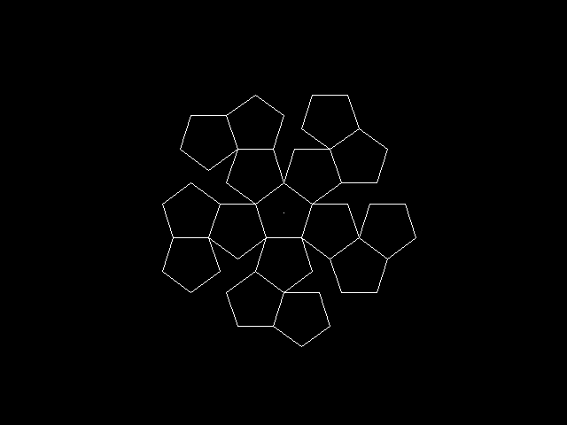|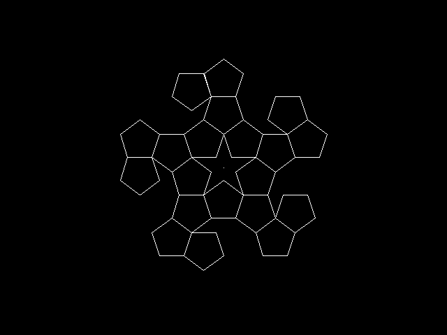|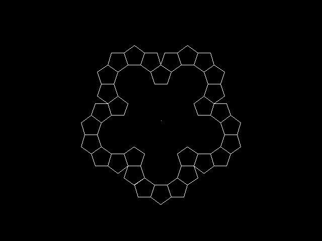|
|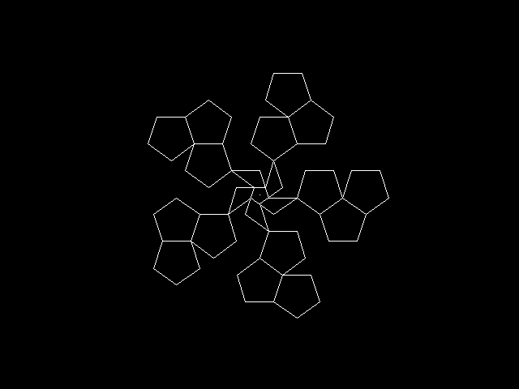|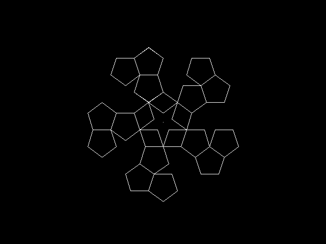|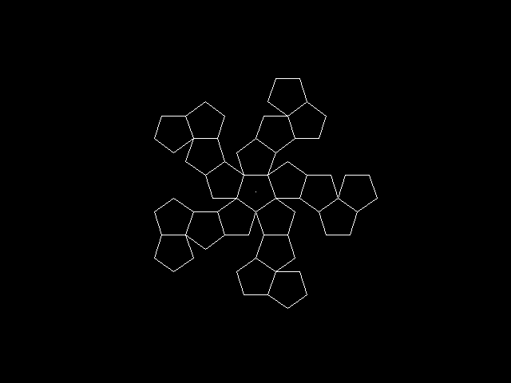|
|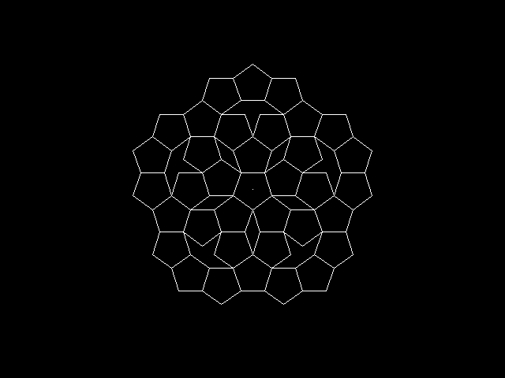|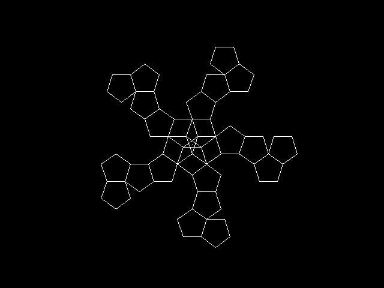||
|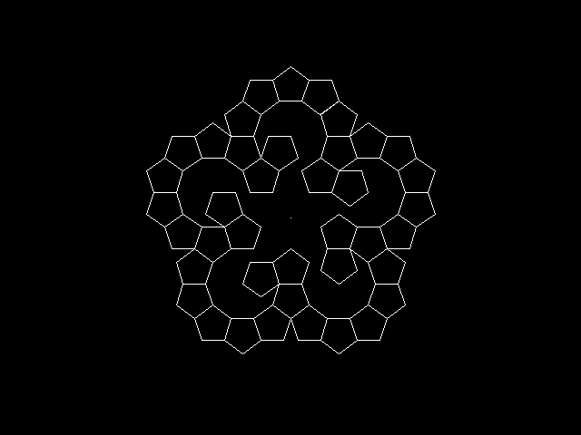|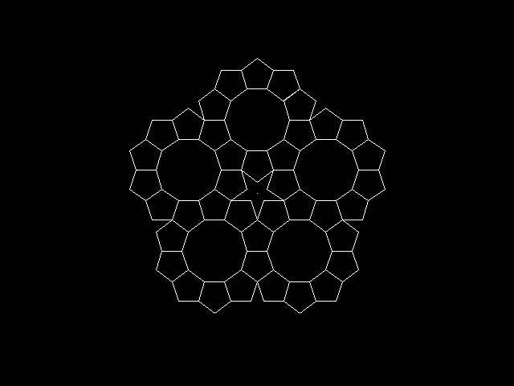|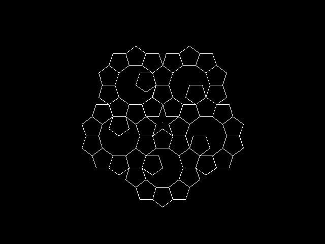|
